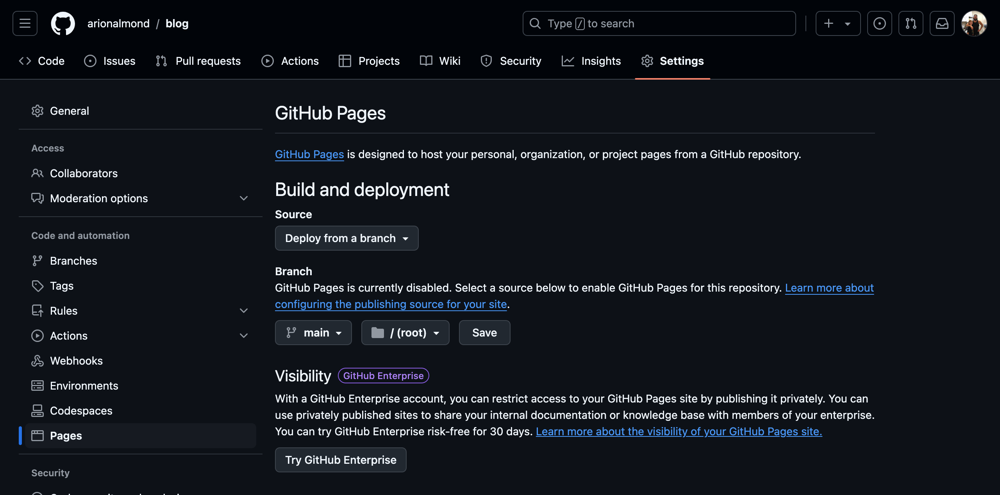

# blog

arionalmond.github.io/blog
formerly github.com/arionalmond/mySite

## Replicate This

Create a basic themed site with hugo
* https://gohugo.io/getting-started/quick-start/

Host the site with Github
* one change to [host on github](https://gohugo.io/hosting-and-deployment/hosting-on-github/) the below is to put the `hugo.yaml` file in `./github/worflows/` folders

* update github repo settings, pages section to deploy branch main

* if a submodule build error occurs, delete the themes/submodule, in my case it was themes/ananke, then

```
git submodule add https://github.com/theNewDynamic/gohugo-theme-ananke.git themes/ananke
```

&nbsp;&nbsp;&nbsp;&nbsp;&nbsp;&nbsp;   

## Adding new Post 
To make this a **little** more real world, lets say to author a new post we want the editor to take a look at the post first with a Pull Request. 

Pull latest on main, create a branch, add your post to `content/posts` with a new `.md` file.  
* Example: `NewPost.md`


